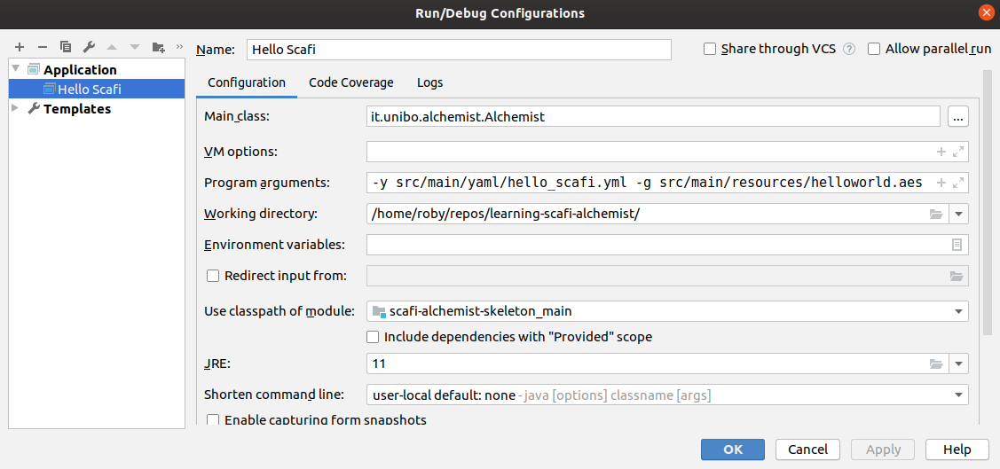

# Learning simulations with ScaFi-Alchemist

* ScaFi is an aggregate programming framework
* Alchemist is a (meta-)simulator

## Alchemist

### Conceptual model

- **Molecule**: name of a data item
- **Concentration**: value associated to a particular molecule
- **Node**: a container of molecules/reactions, living inside an environment
- **Environment**: the Alchemist abstration for the space.
    - It is a container for nodes, and it is able to tell:
  a) Where the nodes are in the space - i.e. their position
  b) How distant are two nodes
  c) Optionally, it may provide support for moving nodes
- **Linking rule**: a function of the current status of the environment that associates to each node a
  neighborhood
    - **Neighborhood**: an entity composed by a node (centre) + a set of nodes (neighbors)
- **Reaction**: any event that can change (through an **action**) the state of the environment
    - Consists of 0+ **conditions**, 1+ **actions**, and a **time distribution**
    - Conditions, time distribution, static rate, and rate equation affect the **frequency** of the reaction
- Alchemist implements an optimised version (NRM) of Gillespie's Stochastic Simulation Algorithm (SSA)

So

- The **system state** depends on the configuration of molecules floating in it
- The **system evolution** depends on the kinds of chemical reactions applicable over time

Another key concept is the **dependency graph**

- Actions are outputs
- Conditions are inputs

### Running simulations

Use task configured in `build.gradle.kts`:

```bash
$ ./gradlew hello
```

Basically, all you need to do to launch a simulation (batch) is running `it.unibo.alchemist.Alchemist`
 with your simulation's descriptor. So, another approach is the following:

```bash
./gradlew fatJar # or shadowJar

java -Xmx2524m -cp "build/libs/<MYFATJAR>.jar" \
  it.unibo.alchemist.Alchemist \
  -b -var random \
  -y <path-to-yaml> -e data/20191004-test \
  -t 100 -p 1 -v &> exec.txt &
```

You can also use some IDE (such as Eclipse or IntelliJ Idea).
In IntelliJ, you can create a run configuration of type `Application`
that looks like the following.



You basically have to pass arguments to the Java program that 
 leverages main class `it.unibo.alchemist.Alchemist`.
Your project must be properly imported and synchronised via Gradle;
 the Scala SDK must be properly set up, as well as the JDK Runtime.
If everything works ok, you should be able to see the following simulation,
which shows a gradient computation on a simulated network situated in the map of Vienna.


### Scafi

The simulation descriptor must indicate `incarnation: scafi`
 and configure a `RunScafiProgram` action
 pointing to the class of some class implementing `AggregateProgram`.

```yaml
incarnation: scafi

pools:
  - pool: &program
    - time-distribution:
        type: ExponentialTime
        parameters: [1]
      type: Event
      actions:
        - type: RunScafiProgram
          parameters: [it.unibo.casestudy.HelloWorld, 5.0] # second argument is retention time
    - program: send
```
An example ScaFi program is the following

```scala
package it.unibo.casestudy

import it.unibo.alchemist.model.implementations.molecules.SimpleMolecule
import it.unibo.alchemist.model.scafi.ScafiIncarnationForAlchemist._

class HelloWorld extends AggregateProgram with StandardSensors with ScafiAlchemistSupport
  with Gradients {
  override def main(): Any = {
    // Access to node state through "molecule"
    val x = if(node.has("prova")) node.get[Int]("prova") else 1
    // An aggregate operation
    val g = classicGradient(mid==100)
    // Write access to node state
    node.put("g", g)
    // Return value of the program
    g
  }
}
```

## On this version and past versions

I will try to keep this repository aligned with the latest versions of scafi and Alchemist.

However, I have also set up different branches to "freeze" particular project configurations that have proven to work.
These can be checked out through the usual git branch mechanism, e.g.:

`git checkout scafi-0.3.2-alchemist-9.2.1`

Available branches/configurations:

- `scafi-0.3.2-alchemist-9.2.1`